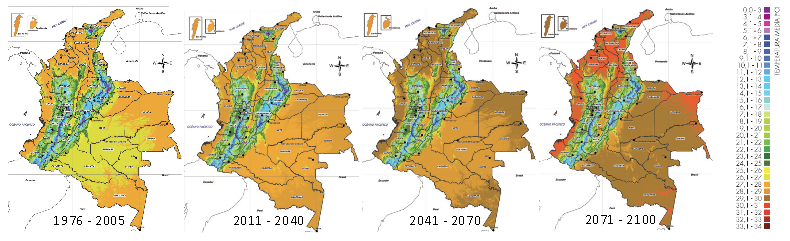
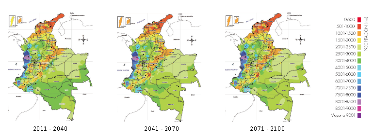
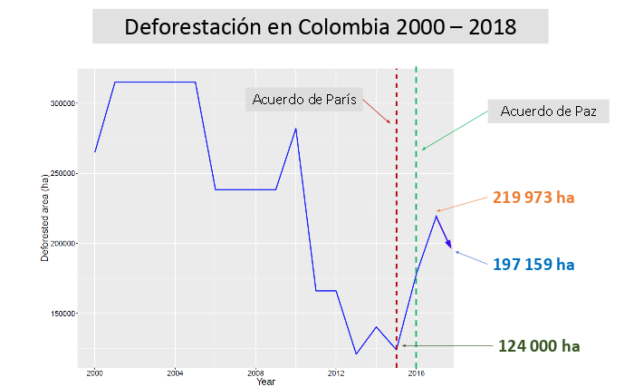
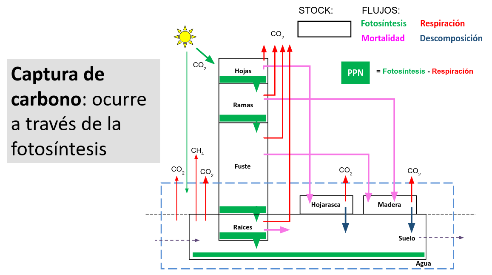
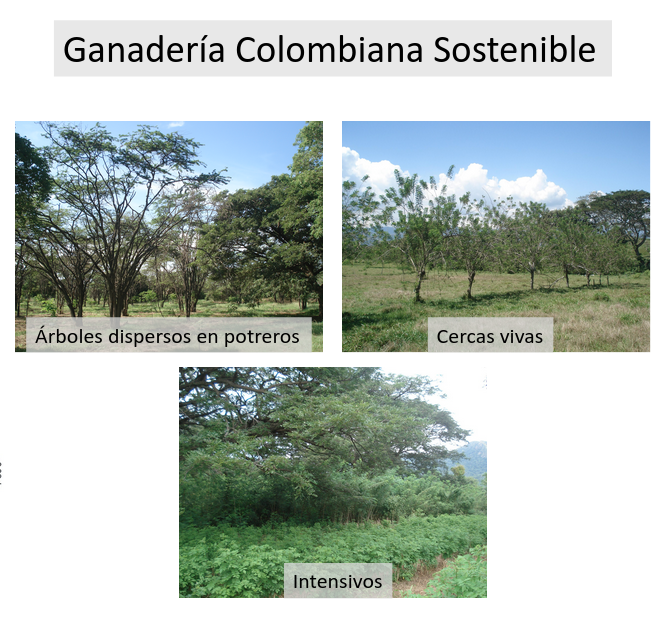

```{r, include=FALSE}
options(tinytex.verbose = TRUE)
```

# Introduction

In an effort to provide decision makers and farmers with better tools to fight the climate crisis. We have developed a web app to democratize access to tools for carbon capture and biodiversity estimation in Colombia. 

The package and web application developed will allow farmers and other interested parties to better plan land use implementations in farms for sustainability. The web app allows users to estimate the carbon capture in their farms and its biodiversity given their current location, current land use and future implementations of coverage replacements like silvopastoral, fencing or forests. Additionally the app provides simulations and projections for land use planing.

In this article we describe the process of estimation and development of the web app and the flow to package the solution as an open source R package (@RCoreTeam) that covers the demands of R users in the environmental field in Colombia, but also the needs of non-tech users that access the computations through a user friendly web interface.

# Background

In Colombia in particular the effects of global warming start to appear INSERT MORE INFO HERE BACKED BY PUBLICATION @Pending. The charts bellow show the annual median temperature has increased and the reduction of annual rainfall.





Additionally, deforestation has played a big role. After the peace agreement signed with FARC Rebels in 2016 there has been a considerable increase in deforestation because of THIS AND THAT @Pending.



## Estimating Carbon Capture in Colombia


Because of phtosythesis some organisms like plants capture carbon dispersed in the atmosphere. This process helps reducing the concentration of green house emissions, which are one of the major causes of global warming @Pending.

INSERT DESCRIPTION ON THE THEORIES AND FORMULAS ON HOW EVERYTHING WAS ALL CALCULATED, EXPLAIN CHART




## Estimating Biodiversity

INSERT DESCRIPTION ON THE THEORIES AND FORMULAS ON HOW IT WAS ALL CALCULATED

## Emision Factors

INSERT DESCRIPTION ON THE THEORIES AND FORMULAS ON HOW IT WAS ALL CALCULATED

## Land Coverage



INSERT DESCRIPTION ON WHY THIS TYPES EXIST OR WHY THEY ARE IMPORTANT.

In livestock management in Colombia. There most common land uses include:

- **Scattered trees**: It refers to native, naturalized or improved pastures in which trees are present in densities greater than 25 trees per hectare.
- **Primary Forest**: Areas of mature forest that have not been intervened by humans in the last 30 years and whose use is strictly conserved. Activities such as timber extraction, hunting and agricultural practices are restricted in these areas.
- **Bosque Secundario**: Forest areas in the process of natural regeneration in response to damage caused by human activities. Its use is of strict conservation and activities such as timber extraction, hunting and agricultural practices are restricted in these areas.
- **Live fences**: Method to devide spaces or define boundaries in a property through planting trees, shrubs or palms as support instead of dead poles as support for barbed wire or smooth wire.
- **Silvopastoral systems**: Arrangements in which there is a mix of trees, pastures and protein rich plants in a high density distribution. 


# Walkthrough

The design process revealed a layout using collapsible panels that proved useful for interacting with the application in a single web ap layout. From left to right, the users are taken through a journey of exploration, from getting a graps of the basic concepts to get simulation and projection results. The app leverage reactivity to auto update custom 

FALTA INCLUIR NÚMEROS EN LA IMAGEN DE ACUERDO DE ACUERDO A LA CONFIRMACIÓN DE PASOS NECESARIOS PARA EL WALKTHROUGH


A step by step guide of the app components follow.

1. Help module: Provides definitions and relevant links
2. Data Input: Users can input their location and the hectares for different land coverage types.
3. Results: This panel show the results, users can display information on carbon capture or biodiversity:
3.1 Carbon capture: It shows the total carbon captured captured and it's equivalence with relatable numbers for non-specialized users in automobile emisions per year. Additionally the results are shown with a stacked visualization chart for each land coverage type. 
3.2 Biodiversity: The estimated number of bird species present in the farm for the given region and land usage is shown to the user
4. Advanced results: A simulation or projection for up to 20 years is visualized to show future estimates of carbon capture for each land coverage type.


# Development

The purpose of the platform developed is to:

1. Estimate carbon capture in colombian farms
2. Estimate Biodiversity present in farms
3. Simulate the effect of carbon capture and biodiversity for different implementation of land coverage types

The first version of this tool involved a series of excel files with different formats. For portability and appropriation reasons there is a need make the implementation available to a wider audience.

Reproducible and accesible results play a big role in the appropriation of data driven tools for decision makers and practitioners in environmental the environmental field This is why we decided to launch a paclkaged solution for farmers and researchers in researchers in Colombia to have access to the most up to date estimates on carbon capture and biodiversity present in colombian farms through out all the territory. These estimates vary from region to region and according to the land coverage types as described in the previous section. 

To this end we used and R package that encompasses a web app using the Shiny framework @Chang2015. This set up provides an appropiate way not only to open up estimations and calculations to the research community for different regions in Colombia, but also to deliver a simple solution for non-tech users to interact with the platform. To this end we went through a design process which led to the following considerations for the web app:

- Single page app
- Modular solution with collapsable panels
- Informative landing page with summaries and relevant links

To achieve this a couple of new developments within the Shiny framework where introduced:

- Implementation and adjustments to a package to lay out Shiny apps as collapsible panels.
- Introduction of new shiny widgets for searching.

## Reproducible Research

When we talk about being able to re-do our data analysis we must ensure that the data structure is the same. To this end, several data sources where standarized so we could have every input compatible with farm locations which is one of the primary user inputs. Farm locations are given by the user at the municipality level in Colombia, each municipality in turn is mapped to the corresponding geographic regions that correspond to available estimations of carbon capture and bird species taken from multiple sources. 

With this standarizations the package provides funcions that translate locations and areas for each coverage type into carbon capture estimations and projections to 20 years. When new data for carbon capture becomes available, updating formulas can be done in configuration files directly in the package, whenever possible, hard-coded models are avoided to facilitate package maintenance.

## Shiny apps in a software package

As mentioned before Shiny allows to run R code in a webpage. Given that we wanted to give an option for non-programmers to interact with the package, we built a web app. In order to incorporate the web app to the package one can simply put the code of the app online in a repository and deploy it for users to interact. This approach is the easiest but it is also difficult to maintain as the package code and the app do not coexist. So in order to allow the two to coexist, but additionally to be able to run the app from within the package on needs to include the web app as a package function. You can run this function with `runGanaderiaSostenible` which is a wrapper call to run Shiny with the code for the app stored in the `inst/` folder of the package. 

To improve usability of the web app custom widgets where developed. The inputSearch widget was adapted from an experimental package. This widget binds a new input to the Shiny framework wich custom javascript code. Additionally custom HTML components where included into the shiny layout dependency to accomodate the large number of components.

New components and input controls where introduced:

- Custom search input
- Collapsible boxes controls
- Year and hectares dynamic inputs combo


## Landing page

The landing page uses a static site generator implemented in the Go language, called Hugo. It contains basic information about the project and is available at: http://datasketch.github.io/landing-gcs 

# Further work

To extend the package, one would need to calibrate the models again given data updates on carbon captures estimations. Re-calibrations of the model amount to changing parameters in a configuration file with in the package. 

For the biodiversity estimation, only bird species where taken into account, note that the species estimations are limited to XXXXX regions covering XXXXX of the national territory. Future versions of this pakage cound incorporate other estimates.


# Acknowledgments

WHO SHOULD WE ACKNOWLEDGE?


