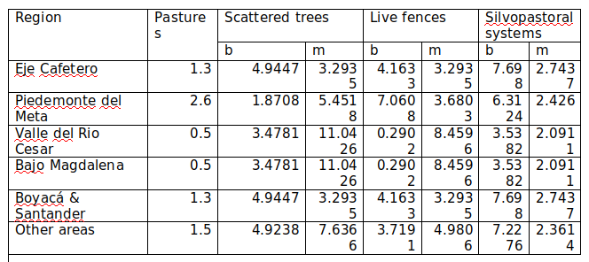
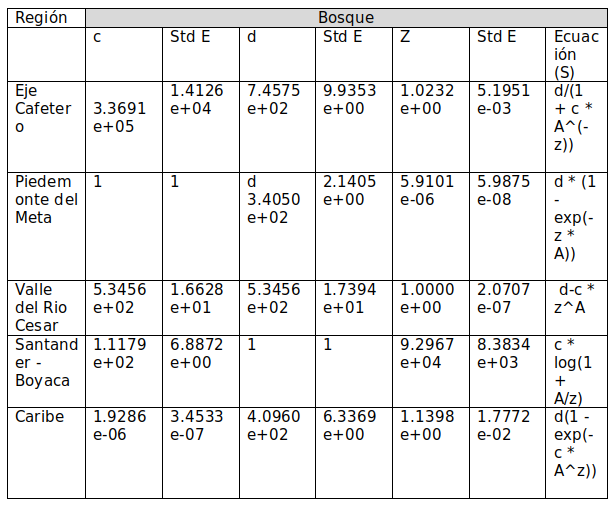
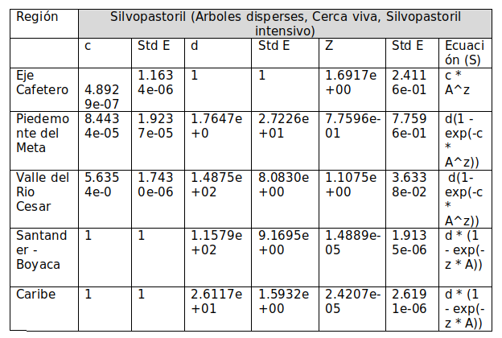
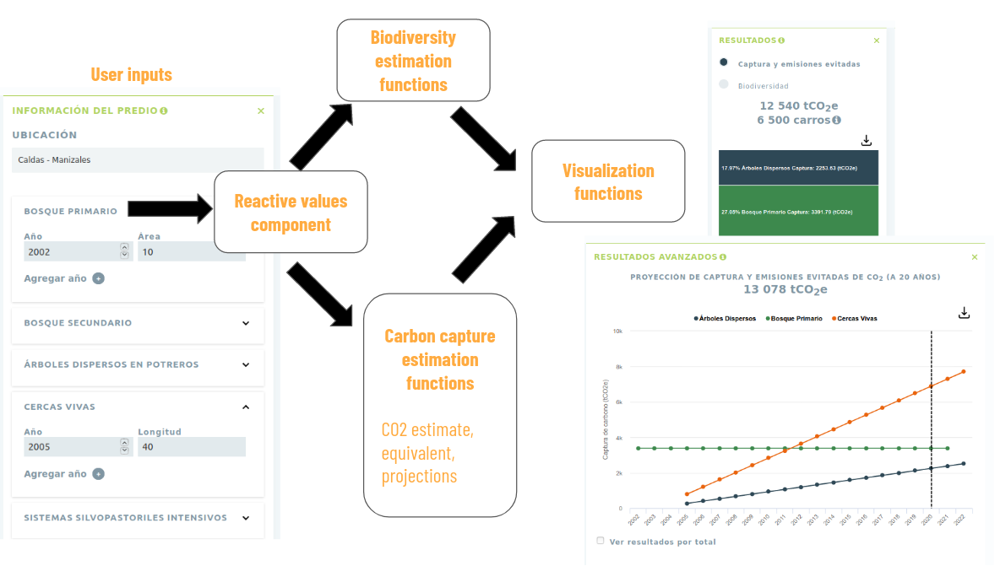
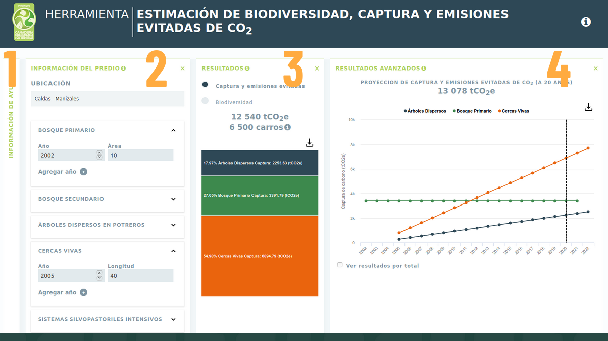

```{r, include=FALSE}
options(tinytex.verbose = TRUE)
```

# Introduction

- AFOLU, one of the largest sources responsible for Climate Change. Calls for mitigation in this sector. Also responsible for biodiversity crisis.
- One mitigation strategy consists of the implementation of silvopastoral practices that both increase productivity and decrease pressure on existing forests. In Colombia, the Sustainable Cattle Ranching project has been fostering the implementation of silvopastoral practices and zero deforestation agreements for the past 6 years. Simultaneously, monitoring of CO2 capture and biodiversity change has allowed the establishment of the relationship between land interventions and biodiversity/CO2.
- Here, we present a web tool that implements the equations of biodiversity and CO2 change calibrated for Colombian cattle ranching landscapes. This tool allows the estimation of CO2 (avoided emissions and capture) and biodiversity for farms of different land cover configurations and project the effect of different implementations into the future. 


# General Setup

This app is devised to provide carbon and biodiversity in farms given where they are located and the areas and the age of their landcover types. We consider 5 landcover types found in cattle ranching landscapes: primary forest, secondary forest, scattered trees, live fences and intensive silvopastoral systems. @Pending

For carbon capture estimation in non-forest land cover types, equation 1 was implemented with the coefficients provided in Table 1 to estimate CO2 emission factors for different regions of the country (Figure 1).

For $t > 0$ 

$$EF(lc,t,r) = [b(lc, r)+m(lc, r)*t] $$

Where $lc$, is the landcover type, $t$ is time since implementation and $r$ is the region. 




For secondary forests, emission factors were calculated according to equation 2 @Sierra:

$$ EF(SF) = 111.51 [(1- e^{\beta_1 t})^{1.964}]^{\beta_2}(\frac{44}{12}) (0.5) $$

Where $\beta_1 = 0.064$ and $\beta_2 = 1.964$

For primary forest, average emissions factors for each municipality were calculated based on IDEAM @Pending.


Finally, at time zero, the emission factor for all landcover types except primary forest corresponds to the emission factor of pastures (Table 1) to account for its conversion into a different landcover type. 

To obtain the total CO2 capture by landcovers other than primary forest within a farm at time T:

$$ CO2capture = \sum_{tc,t0}{A(lc, t_0)(EF(lc, t_0) - EF(lc, t = t_0))}$$

And to obtain total avoided emissions of CO2

$$AvoidedCO2emissions = A(PF)* EF(PF, location)$$

For all calculations we assumed a maximum time horizon of 20 years


## Biodiversity estimations

The number of bird species is calculated using area species models. These types of models generally follow a power law that describes how the number of species increases with increasing area.

$$ S = c * A^z $$


Where $S$ is the number of species, $A$ is the sampled area, c and z are coefficients of the estimated relationship or parameters of the data. Some cases include other coefficients such as $d$ and $f$.

However, not all data and organisms fit that equation. About 20 models have been described in the biodiversity literature, and here are presented the models that had the best fit to each of the project geographies and type of vegetation cover.

Ideally the calculations should be done with each equation, but if it is too complicated, the equation above would be acceptable.

The details of the coefficient calculations are available at: http://rpubs.com/dlizcano/549379

Coeficients and ecuations for bird biodiversity estimations





# Development

The application was developed using the R Language @RCoreTeam to create an R package that encompasses a web app using the Shiny framework @Chang2015. This set up provides an appropiate way not only to open up estimations and calculations to the research community for different regions in Colombia, but also to deliver a simple solution for non-tech users to interact with the platform. To this end we went through a design process which led to design considerations that included a single page app with modular solution with collapsable panels.

The web app uses the _shinypanels_ package for laying out elements for user inputs and results with custom enhancements including a shiny input binding to provide search capabilities. Data visualizations where done using the _highcharter_ package. Relevant functions are exported to R users to access internal calculations of CO2 capture and its projections that return tidy dataframes, see the function _GanaderiaSostenible::estimacion_co2_tidy for instance.

The app is available to install from CRAN and a development version is hosted on github and can be installed with `remotes::install_github("datasketch/GanaderiaSostenible")`. To run the app R Users can simply run this command in the console after installing the package: `runGanaderiaSostenible`. A hosted version is also available for non R users at http://datasketch.github.io/ganaderiasostenible 




# Walkthrough

The design process revealed a layout using collapsible panels that proved useful for interacting with the application in a single web ap layout. From left to right, the users are taken through a journey of exploration, from getting a graps of the basic concepts to get simulation and projection results. The app leverage reactivity to auto update user inputs.




A step by step guide of the app components follow.

1. Help module: Provides definitions and relevant links
2. Data Input: Users can input their location and the hectares for different land coverage types.
3. Results: This panel show the results, users can display information on carbon capture or biodiversity. (3.1) Carbon capture: It shows the total carbon captured captured and it's equivalence with relatable numbers for non-specialized users in automobile emisions per year. Additionally the results are shown with a stacked visualization chart for each land coverage type. (3.2) Biodiversity: The estimated number of bird species present in the farm for the given region and land usage is shown to the user
4. Advanced results: A simulation or projection for up to 20 years is visualized to show future estimates of carbon capture for each land coverage type.


# Future Directions

To extend the package, one would need to calibrate the models again given data updates on carbon capture estimations. Re-calibrations of the model amount to changing parameters in a configuration file within the package. 

For the biodiversity estimation, only bird species where taken into account, note that the species estimations are limited to XXXXX regions covering XXXXX of the national territory. Future versions of this pakage cound incorporate other estimates.


# Author contributions

World Bank, UK Government, CIPAV, Fondo Acción

Author contributions
Juan Pablo Marín Díaz,  Shiny web app development, R package development, wrote manuscript.
Camila Achuri, R package development.
Mariana Villamizar, UX/UI design.
David Daza, R package development.
Diego Navarrete, Carbon capture and avoided emissions estimations, wrote manuscript
Digo Lizcano, Biodiversity estimations, wrote manuscript
Jorge Velazquez, designed and supervised project, wrote manuscript, ran tests and calculations.


# Appendix 1. Estimation of CO2 emission factors in sustainable cattle ranching landscapes

Add if needed

# Appendix 2. 

Add if needed

# Appendix 3. Development setup and R package details


## Reproducible Research

When we talk about being able to re-do our data analysis we must ensure that the data structure is the same. To this end, several data sources where standarized so we could have every input compatible with farm locations which is one of the primary user inputs. Farm locations are given by the user at the municipality level in Colombia, each municipality in turn is mapped to the corresponding geographic regions that correspond to available estimations of carbon capture and bird species taken from multiple sources. 

With this standarizations the package provides funcions that translate locations and areas for each coverage type into carbon capture estimations and projections to 20 years. When new data for carbon capture becomes available, updating formulas can be done in configuration files directly in the package, whenever possible, hard-coded models are avoided to facilitate package maintenance.

## Shiny apps in a software package

As mentioned before Shiny allows to run R code in a webpage. Given that we wanted to give an option for non-programmers to interact with the package, we built a web app. In order to incorporate the web app to the package one can simply put the code of the app online in a repository and deploy it for users to interact. This approach is the easiest but it is also difficult to maintain as the package code and the app do not coexist. So in order to allow the two to coexist, but additionally to be able to run the app from within the package on needs to include the web app as a package function. You can run this function with `runGanaderiaSostenible` which is a wrapper call to run Shiny with the code for the app stored in the `inst/` folder of the package. 

To improve usability of the web app custom widgets where developed. The inputSearch widget was adapted from an experimental package. This widget binds a new input to the Shiny framework wich custom javascript code. Additionally custom HTML components where included into the shiny layout dependency to accomodate the large number of components.

New components and input controls where introduced into this package:

- Custom search input
- Collapsible boxes controls
- Year and hectares dynamic inputs combo

## Landing page

The landing page uses a static site generator implemented in the Go language, called Hugo. It contains basic information about the project and is available at: http://datasketch.github.io/landing-gcs 
This paper was generated using RMarkdown.

